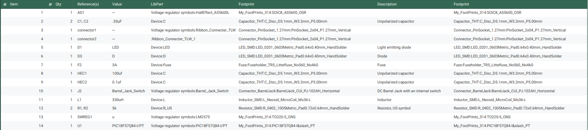

## Overview
For this project we had a purchasing budget of $60 for various parts, The Bill of Materials below shows the materials and cost used to create the sensor sunsystem of team 306's Subteranian Rover. 

## Bill of Materials
{style width: "2000"}
**Figure 01:**  Bill of Materials 

## Resouce

The Bill of Material as a PDF download is available [*here*](BOM314.pdf).
