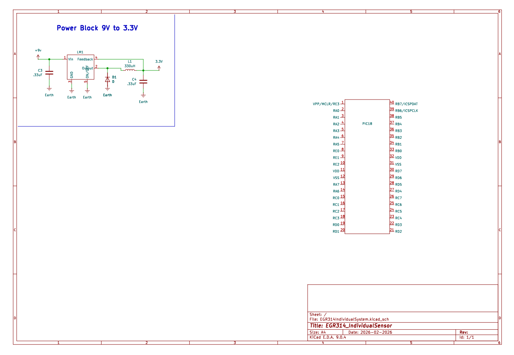

## Overview

This schematic is design to support a surface mounted temperature sensor 

{style width:"350" height:"300;"}
**Figure ##:** Showing a example schematic.

## Resouces

The schematic as a PDF download is available [*here*](ExampleSchematic.pdf), and the Zip folder of the project [*here*](dummyZip.zip).