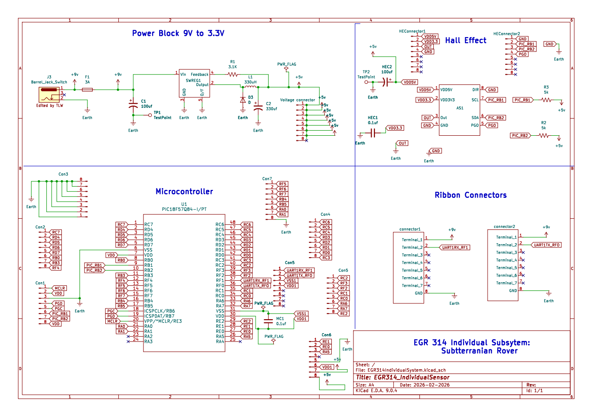

## Overview
This schematic is design to support a surface mounted Hall effect Sensor

{style width:"350" height:"300;"}
**Figure ##:** Showing the schematic with the Hall Effect Sensor.

## Resouces
The schematic as a PDF download is available [*here*](EGR314IndividualSystem(2).pdf), and the Zip folder of the project [*here*](EGR314IndividualSystem.zip).