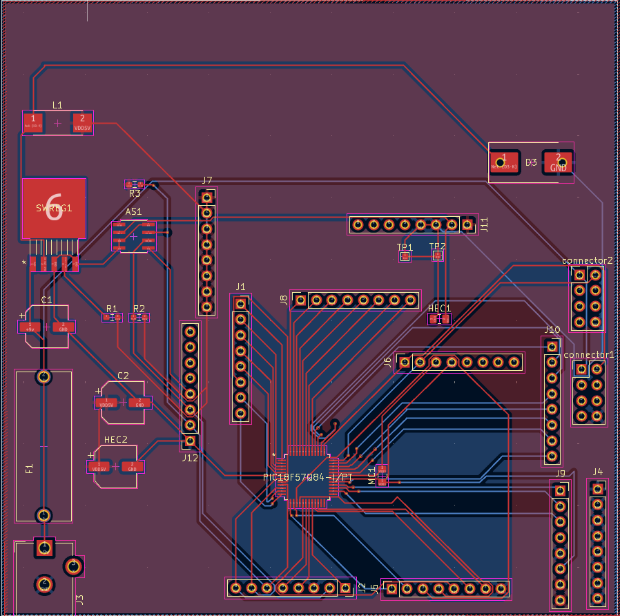
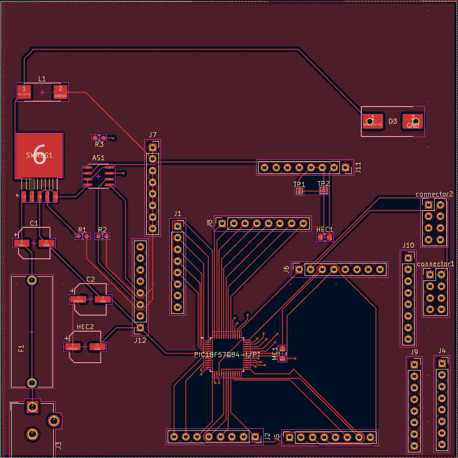
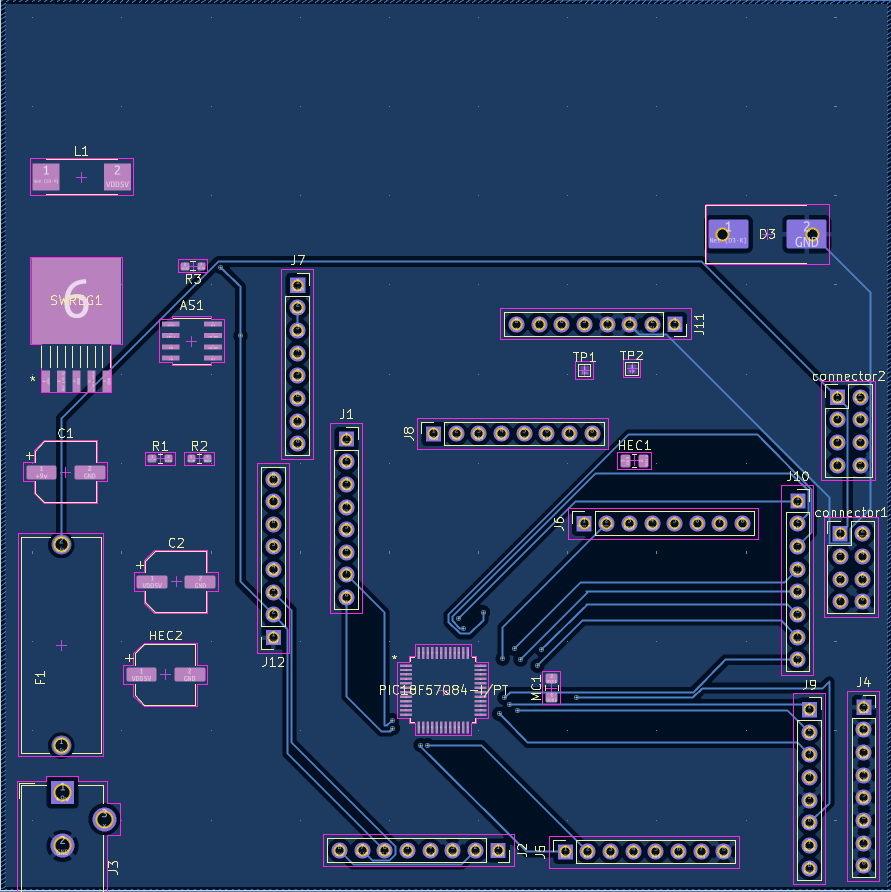

## Overview

This PCB is design to support a surface mounted Hall effect Sensor 

**Figure ##:** Showing the Final PCB design for Hall effect Sensor. 

The top Layer 3.3V and Bottom Layer GND are shown below aswell:

**Figure ##:** Showing the top layer of the PCB design. 

**Figure ##:** Showing the Bottom Layer of the PCB design. 