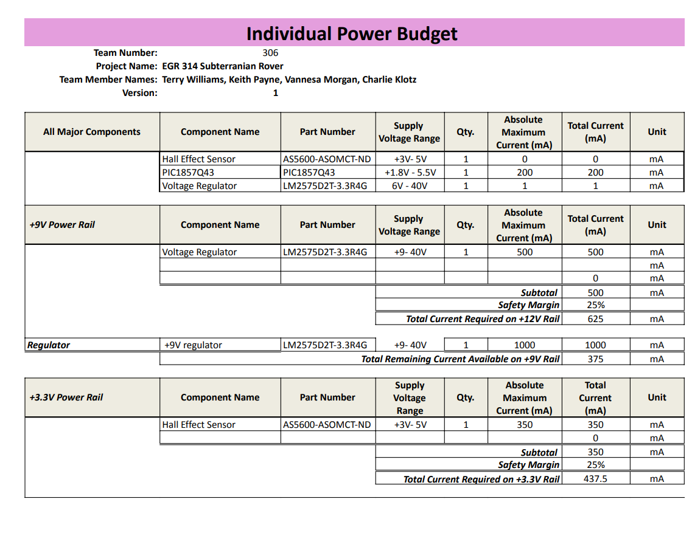
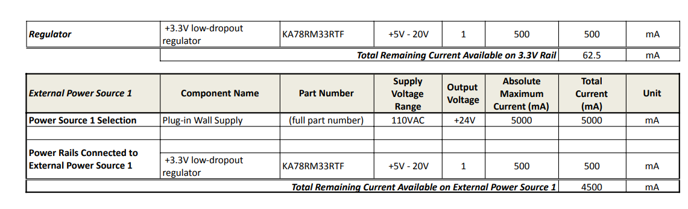

## Overview

The power budget for the rover confirms that the 3.3 V switching regulator and overall supply can comfortably support the final design. The PIC18F57Q43 microcontroller, AS5600 Hall effect sensor, wireless module, and supporting peripherals all draw well below the 1 A limit of the regulator, even under worst case assumptions. By estimating each subsystem’s current and then summing them with a safety margin, the total load remains within a safe operating range for both the regulator and the upstream supply. This shows that the rover can run all critical electronics simultaneously without overloading the power system or causing excessive voltage droop.

## Power Budget

## Conclusion

The completed power budget demonstrates that the hardware design is electrically feasible and has reasonable margin for real operation. The Hall effect subsystem in particular adds only a small current overhead compared to the total capacity of the 3.3 V rail. With proper decoupling and layout, the regulator can deliver stable power to the microcontroller, sensor, and communication modules without approaching its maximum rating. Overall, the power budget supports the final design choices and confirms that no major changes are required for Version 2.0 from a current capacity standpoint.

The Power Budget as a PDF download is available [*here*](EGR314-Power-Budget.pdf).